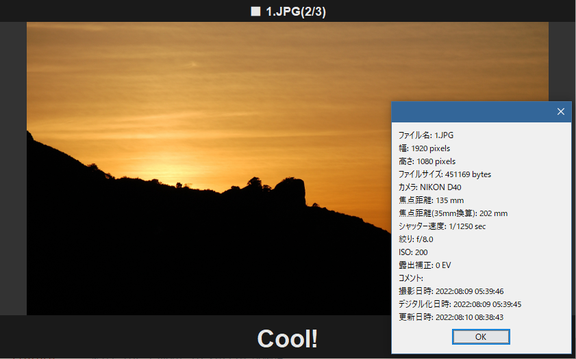

# Shiraki(白木)

## Goal

- Show image files in the directory one by one
- Show comment on each image as well
  - comments are read from `UserComment` entry of Exif meta data
  - or the comment file
- Can be operated by keyboard

## Screenshot



## Usage

```
$ java -jar shiraki.jar [DIR] [INTERVAL(msec)]
```

Shows all jpeg files in the current directory (or DIR) in order of timestamp. Default interval is 4000msec.

## Comment file

The comment file is `.shiraki.edn`. It's written in edn format and placed in the same directory as image files. It consists of a hash map, whose keys are file name(upper case string/keyword) and values are comment string.

```
{
 "1.JPG" "Cool!"
 :2.JPG "ナイス!"
 }
```

## Operation with keyboard

- `SPACE` key ...Pause(toggle) slideshow
- Right arrow key ...Show next image
- Left arrow key ...Show previous image
- `I` key ...Show Exif meta data
- `ESCAPE` or `Q` key ...Quit the application

## メモ

### 動機

- 登山やハイキングの写真を整理するとき、コメントも付けて残したいと思うことがある
- ほぼYamapで足りるけど、Yamapにアップできない写真もある
- markdownで書いて、html化する?
- スライドショーで表示したい
- アプリのインストールとか不要な方がいい

### 開発
- [ ] Leiningenを使用
- [ ] [xfce]フルスクリーンを解除したとき、ウィンドウサイズが大きいままになってしまう?
- [ ] [mac]Exif情報のメッセージボックスが親ウィンドウに隠れてしまう
  - `setFullScreenWindow`でフルスクリーン化してるせい?
- [ ] [mac]OS XネイティブのフルスクリーンモードをプログラムでON/OFFする方法は?
- [ ] 写真の描画速度が少し気になる
